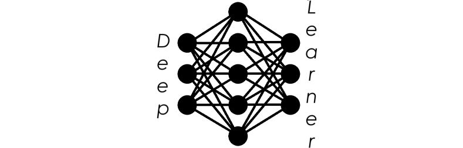

----------------------------------------------------------------------

## About Deep Learner

Deep Learner is a deep learning Python library. Keeping everything simple and readable for any Python developper, it provides core functionalities to build, train and save deep learning models.

The library does not aim to rival big names like [PyTorch](https://pytorch.org/) or [Hugging Face](https://huggingface.co/), it is a modest library built with the sole purpose of deepening my understanding of deep learning and AI engineering. Therefore, I implement as much as I can by myself which results in code that is not optimized at all (although I try not to write garbage code from the get go).

## Rationale

Looking through the code, you will probably think: *"This looks awfully similar to PyTorch."*; and you would be right. The whole idea of this library stems from me using PyTorch to build and train AI models. I will try to keep the API of the library as close as possible to PyTorch API such that Deep Learner can almost be a drop-in replacement; I still reserve myself the possibility to make different design choices (even if they are objectively not for the best).

Though Deep Learner and PyTorch serve the same purpose, Deep Learner is **not** a copy-paste library :

* everything is implemented by my hand as I see fit, no copy and no pasting (nor AI generated code for that matter)
* formulas are derived by hand (hopefully with no errors)
* although not minimalistic, it's a small scale library that get things done without covering every use case
* highly unoptimized, unfortunately
* readable at every layer (whereas the deeper you get into PyTorch, the messier and "C++-ier" it gets)

My only goal with this library is to learn and grow both as a data scientist and a Sunday software engineer. Of course, I would be happy to see it used by others.

## How does it work

Much similar to Pytorch, the library revolves around a [`Tensor`](src/deep_learner/_tensor.py) object.

A `Tensor` is an object wrapping a multi-dimensional array, either on CPU or GPU. The `Tensor` exists to record operations performed in a computation graph. Let's take an example :

```python
from deep_learner import Tensor

x = Tensor([1, 2, 3], requires_grad=True)
y = Tensor([4, 5, 6])

z = x * y
```

In order to be able to "backpropagate" from `z` to `x`, Deep Learner needs to know how `z` was computed and if `x` was involved at all; to address this issue, every computed `Tensor` stores, along with its data, a *gradient function* (as in a "Python function"). The gradient function itself holds all the necessary information to compute the gradient of the associated node, given a previous gradient:

```python
print(z)
# >>> Tensor(
#       [ 4 10 18],
# grad_func=<MutliplyBackward>, device=Device.CPU)

print(x.grad)
# >>> Tensor(
#       [0. 0. 0.],
# device=Device.CPU)

# Backpropagate from z to x and y
z.backward()

print(x.grad)
# >>> Tensor(
#       [4. 5. 6.],
# device=Device.CPU)
```

The computation graph is recorded implicitly and dynamically which allows for greater flexibility at the cost of slower executions. An interesting axis of improvement would be to optimize the computation graph before actually computing anything, but this is yet to be done.

## Standing on the shoulders of giants

Scientific computing relies on two libraries: [NumPy](https://numpy.org/) for CPU-computing and [CuPy](https://cupy.dev/) for GPU-computing (CUDA). Those are two inevitable dependencies for the moment as I want to focus on implementing the reverse-mode differentiation engine rather than array computing primitives. Nonetheless, my other project [array.c](https://github.com/PaulWassermann/array.c) tackles this very subject; if it gets to a point where it can be used by Deep Learner for computations across CPU and GPU devices, I might look into implementing Python bindings and remove entirely third-party dependencies.

## License

See [LICENSE](LICENSE).
